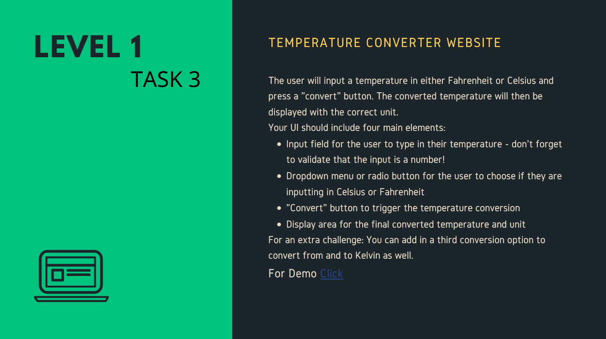

# Task 03- Temperature Converter



## Description

This is a simple temperature converter web application created as part of Task 3 of the OIBSIP Web Development Internship 2024.

## Installation and Running

To run this project locally, simply  download this repository as zip or you can clone this repository to your local machine using:

```
git clone https://github.com/Programer3/OIBSIP.git
```

Then, open the Task 03 - Temperature Converter folder and open the `index.html` file in your browser or better,
download live-server extension for  vs-code and run `index.html` file with that.

To use the app enter the temperature in either Celsius, kelvin or Fahrenheit and click the "Convert" button. The temperature will be converted to the other unit and displayed on the page. It also works dynamically real time.

## Technologies Used

This web application was created using HTML, CSS, and JavaScript.

## License

This project is licensed under the `MIT License`. See the LICENSE file for details.
